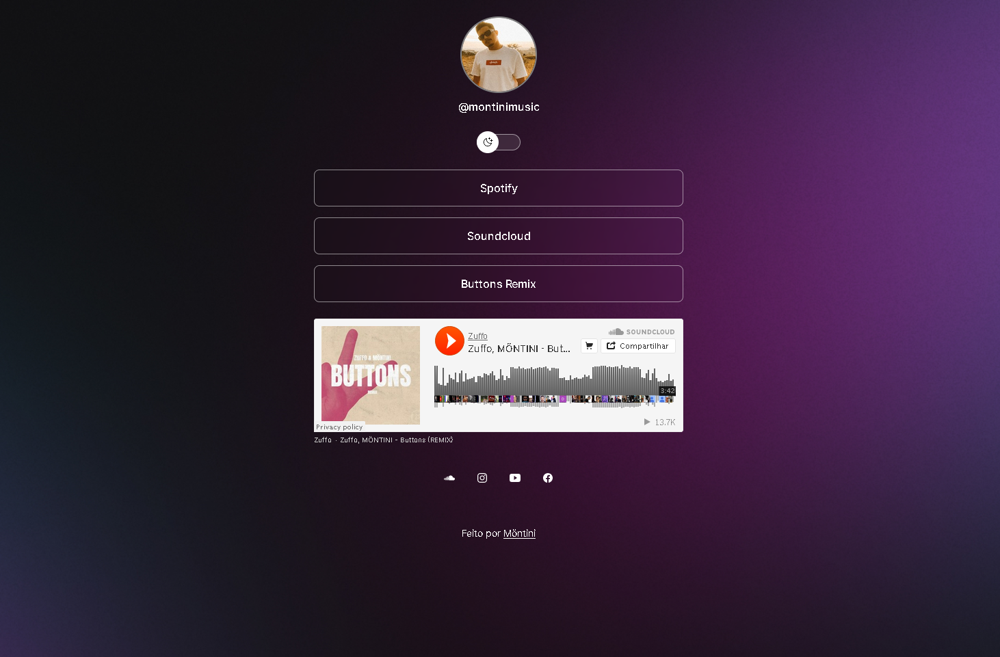
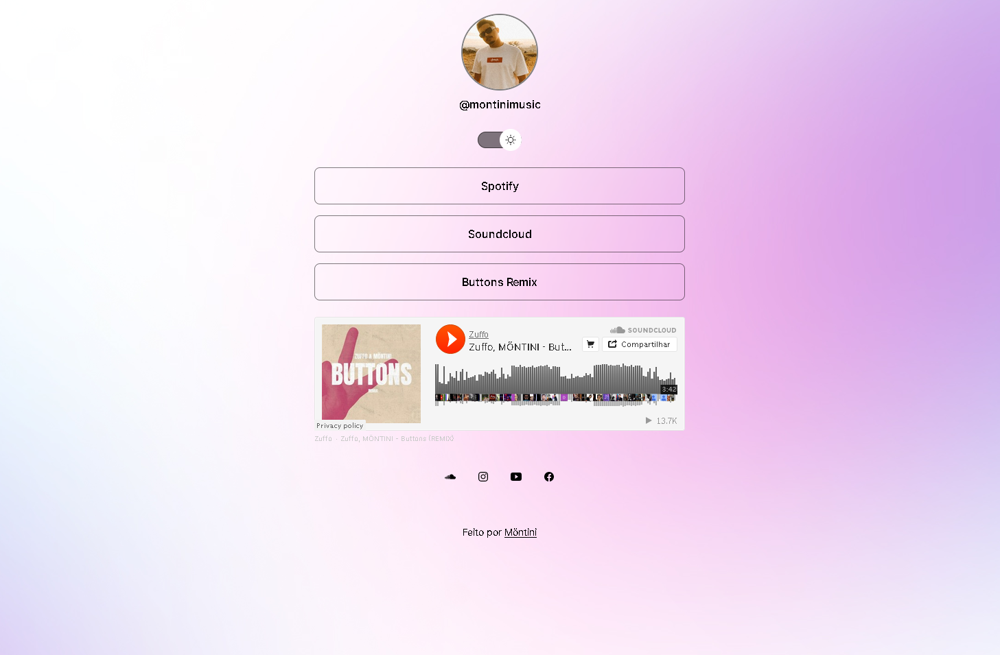

<h1 align="center"> Arvore de Links </h1>

  <a href="#-tecnologias">Tecnologias</a>&nbsp;&nbsp;&nbsp;|&nbsp;&nbsp;&nbsp;
  <a href="#-projeto">Projeto</a>&nbsp;&nbsp;&nbsp;|&nbsp;&nbsp;&nbsp;
  <a href="#memo-licença">Licença</a>

  

 

    <h2 align="center">Dark</h2>
  
   <h2 align="center">Light</h2>
  

## 🚀 Tecnologias

Esse projeto foi desenvolvido com as seguintes tecnologias:

- HTML e CSS
- JavaScript
- Git e Github
- Figma

## 💻 Projeto

Um agregador de links para usar como cartão de visitas online.

- [Acesse o projeto finalizado, online](https://projeto-discover-delta.vercel.app/)

## :memo: Licença

Esse projeto está sob a licença MIT.

---
